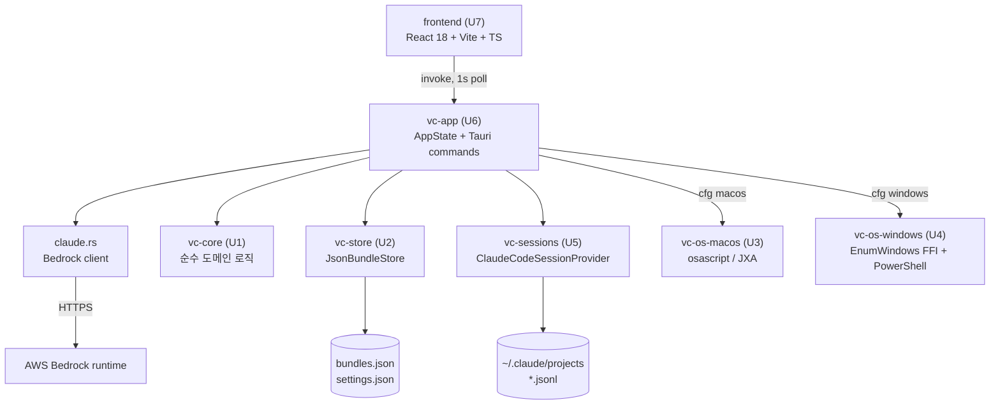

# vibe-control

> 흩어진 작업을, 하나의 묶음으로.

**vibe-control**은 여러 프로젝트를 오가는 개발자·디자이너를 위한 **로컬 전용 데스크톱 앱**입니다. 프로젝트마다 필요한 앱·창·탭·폴더·URL·코딩 에이전트 세션을 하나의 **작업 묶음(Work Bundle)** 으로 저장해 두고, 버튼 한 번으로 그 작업 환경을 통째로 복원·전환합니다.

[Tauri v2](https://tauri.app) 기반이라 서버·클라우드 없이 로컬에서만 동작하며, macOS와 Windows를 모두 지원합니다. (유일한 아웃바운드 통신은 앱 하단 Claude 콘솔이 AWS Bedrock을 호출할 때뿐입니다.)

---

## 주요 기능

- **작업 묶음(Work Bundle) 관리** — 프로젝트별 리소스를 하나의 묶음으로 생성·삭제하고 관리합니다.
- **드래그 등록** — 현재 실행 중인 앱·창을 묶음 카드로 끌어다 놓아 등록합니다.
- **한 번에 복원** — 묶음에 담긴 앱·폴더·URL을 순서대로 다시 엽니다. 일부가 실패해도 나머지는 계속 복원하고 결과 리포트를 보여줍니다.
- **실행 중인 앱/창 조회 & 포커스** — 좌측 패널에서 현재 열린 앱과 창 목록을 실시간(1초 폴링)으로 확인하고, 클릭 한 번으로 특정 창을 최전면으로 가져옵니다.
- **코딩 세션 연동** — `~/.claude/projects/**/*.jsonl`을 읽기 전용으로 파싱해 Claude Code 세션의 마지막 질문·답변 상태를 표시하고, 세션 재개(Resume)·터미널 포커스(View)를 지원합니다.
- **앱 내 Claude 콘솔** — 하단 콘솔에서 AWS Bedrock 경유로 Claude에게 직접 프롬프트를 보낼 수 있습니다.

---

## 지원하는 리소스 종류

| 종류 | 설명 |
|---|---|
| **WindowRef** | 실행 중인 특정 창 참조 (Windows HWND / macOS `name·title`) |
| **AppLaunch** | 앱 실행 |
| **Folder** | 폴더 열기 |
| **Url** | URL 열기 |
| **BrowserTab** | 브라우저 탭 (macOS Safari/Chrome) |
| **CodingSession** | Claude Code 등 코딩 에이전트 세션 |

---

## 아키텍처

단일 Tauri v2 앱으로, Rust Cargo 워크스페이스(6개 크레이트) + React/Vite/TypeScript 프론트엔드로 구성됩니다. 상태의 단일 소스는 `vc-app`의 `AppState`이고, 프론트엔드는 Tauri `invoke` 커맨드로만 통신합니다.



| 크레이트 | 역할 |
|---|---|
| `vc-core` | 순수 도메인 로직 (I/O 없음) — 리소스 모델·매칭·복원 계획·상태 판정·정규화·마이그레이션 |
| `vc-store` | 로컬 영속화 — `bundles.json`(원자적 교체) / `settings.json` |
| `vc-os-macos` | macOS 어댑터 — `osascript`/JXA, `NSWorkspace` |
| `vc-os-windows` | Windows 어댑터 — Win32 `EnumWindows` FFI + PowerShell |
| `vc-sessions` | 코딩 에이전트 세션 읽기 전용 열람 |
| `vc-app` | 오케스트레이션 + Tauri 커맨드 브리지 + Bedrock 클라이언트 (바이너리) |
| `frontend` | 다크 대시보드 UI (좌: 실행 패널 / 우: 묶음 카드 / 하단: Claude 콘솔) |

데이터는 OS의 config 디렉터리에 저장됩니다: `<OS config>/vibe-control/bundles.json`, `settings.json`.

---

## 요구 사항

- **Node.js / npm** — UI를 빌드할 때 한 번 필요합니다
- **Rust (stable) + MSVC/Clang 툴체인**
  - Windows: `stable-x86_64-pc-windows-msvc` + Visual Studio 2022 MSVC 링커
  - macOS: `stable` + Xcode Command Line Tools
- **WebView 런타임**
  - Windows: WebView2 (Windows 11 기본 탑재)
  - macOS: WKWebView (OS 기본 탑재)

Rust가 없다면:

```bash
# Windows
winget install --id Rustlang.Rustup -e

# macOS
curl --proto '=https' --tlsv1.2 -sSf https://sh.rustup.rs | sh
```

---

## 설치 및 실행

소스에서 직접 빌드해 실행합니다. 프론트엔드 UI는 빌드 시 Rust 바이너리에 그대로 내장되므로, 아래 세 단계만 거치면 완성된 앱이 실행됩니다. (별도 Tauri CLI 설치는 필요 없습니다.)

### 1. 프론트엔드 UI 빌드 (최초 1회)

```bash
cd frontend
npm install
npm run build
```

`npm install`은 처음 한 번만 하면 되고, 이후에는 이 단계를 건너뛰어도 됩니다.

### 2. 앱 빌드

저장소 루트로 돌아와 Rust 앱을 빌드합니다. 최초 빌드는 몇 분 걸리지만, 이후 다시 빌드할 때는 훨씬 빠릅니다.

```bash
cd ..
cargo build -p vc-app
```

### 3. 앱 실행

```bash
# Windows
./target/debug/vibe-control.exe

# macOS / Linux
./target/debug/vibe-control
```

창이 뜨면 정상입니다. (앱은 정상 실행 시 터미널에 아무것도 출력하지 않습니다.)

> 두 번째 실행부터는 3번 단계만 하면 됩니다. 코드를 받아 다시 빌드할 때만 1~2번을 반복하세요.

---

## 배포용 설치 파일 만들기 (선택)

배포할 수 있는 설치 파일(Windows `.msi`/`.exe`, macOS `.dmg`/`.app` 등)을 만들려면 Tauri CLI를 사용합니다. 각 OS에서 해당 OS용으로 각각 빌드해야 합니다.

```bash
cargo install tauri-cli   # 최초 1회 (설치에 시간이 걸립니다)
cargo tauri build
```

완성된 설치 파일은 `target/release/bundle/` 아래에 생성됩니다.

---

## Claude 콘솔 설정 (선택)

앱 하단의 Claude 콘솔은 AWS Bedrock Runtime을 HTTPS로 호출합니다. 콘솔 모달에서 **Bedrock API 키**와 **모델**을 설정하면 사용할 수 있으며, 사용자가 명시적으로 입력한 프롬프트만 전송됩니다. 설정하지 않으면 나머지 기능은 그대로 동작합니다.

---

## 프로젝트 구조

```text
vibe-control/
├── crates/
│   ├── vc-core/          # 순수 도메인 로직
│   ├── vc-store/         # 로컬 영속화
│   ├── vc-os-macos/      # macOS 어댑터
│   ├── vc-os-windows/    # Windows 어댑터
│   ├── vc-sessions/      # 코딩 세션 열람
│   └── vc-app/           # Tauri 앱 (바이너리)
├── frontend/             # React + Vite + TS UI
├── landing/              # 랜딩 페이지 (GitHub Pages)
├── aidlc-docs/           # 설계·리버스 엔지니어링 문서
└── Cargo.toml            # 워크스페이스 매니페스트
```

---

## 라이선스

MIT
