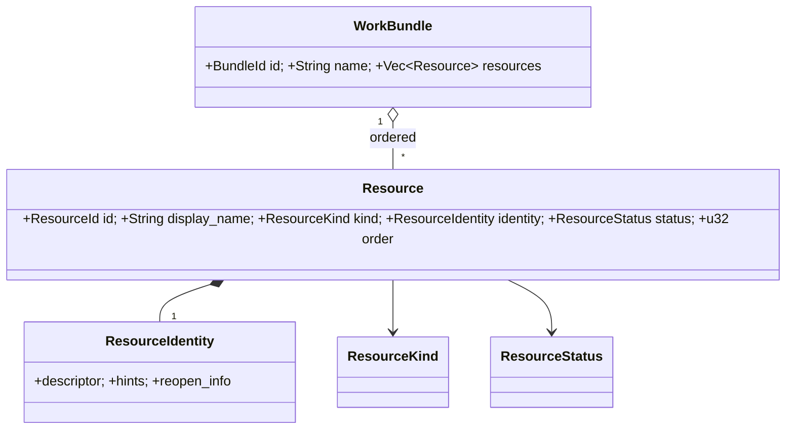

# 도메인 엔티티 — U1 vc-core

단계: CONSTRUCTION — U1 vc-core, Functional Design
성격: 기술 비종속 순수 도메인. 저장 포맷·OS API 미포함.
확정 결정: 복합 식별(서술자+MatchSignature) · 계층 매칭 · 상태 우선순위 규칙 · 세션 3-상태.

---

## 1. 엔티티 / 값 타입

### WorkBundle (엔티티)
| 필드 | 타입 | 설명 |
|---|---|---|
| id | BundleId (UUID) | 불변 식별자 |
| name | String | 표시 이름(편집 가능) |
| resources | Vec<Resource> | **정렬 순서 보존** |
- **불변식**: 동일 `MatchSignature`를 갖는 리소스 2개 이상 불가(FR-3.4/AC-3). name 비어있지 않음(공백 트리밍).

### Resource (엔티티)
| 필드 | 타입 | 설명 |
|---|---|---|
| id | ResourceId (UUID) | 불변 식별자 |
| display_name | String | 표시 이름(편집 가능, 식별정보와 분리) FR-6.1/6.3 |
| kind | ResourceKind | 종류 |
| identity | ResourceIdentity | 안정 서술자(+비영속 힌트) |
| status | ResourceStatus | 파생 값(저장은 캐시, 권위는 평가) |
| order | u32 | 묶음 내 정렬 순서 |
- **불변식**: identity의 안정 서술자는 표시 이름 변경으로 바뀌지 않음.

### ResourceKind (열거)
`WindowRef` · `BrowserTab` · `BrowserTabLive` · `Folder` · `AppLaunch` · `Url` · `CodingSession`

> **`BrowserTabLive` (2026-09-09 추가)** — 실행 중 브라우저의 **라이브 탭**을 좌측 패널에서 드래그해 작업 묶음에 등록하는 **포커스 전용** 종류. URL을 보유하는 캡처용 `BrowserTab`과 달리, UIA가 백그라운드 탭 URL을 주지 않고 FR-9.7이 추측을 금하므로 **URL 없이** 제목(`descriptor`)+활성화 토큰(`hint`=`<browser>\u{1f}<hwnd>\u{1f}<idx>`)만 저장하고 `reopen_info`는 없다. 복원은 URL을 열지 않고 탭을 재포커스한다.

### ResourceStatus (열거)
`Active` · `Inactive` · `PermissionRequired` · `Unknown`

### SessionCompletion (열거) — 세션 3-상태
`Waiting` · `NotWaiting` · `Unknown`

### AppSettings (값 타입)
| 필드 | 타입 | 설명 |
|---|---|---|
| panel_width | f32 | 실행 패널 너비 |
| card_height | f32 | 카드 높이 |
| window_rect | Option<Rect> | 창 위치/크기 |
| card_columns_hint | Option<u8> | 반응형 힌트(옵션) |

---

## 2. ResourceIdentity (복합 식별 — 종류별 서술자)

> **안정 서술자**(영속·매칭 근거) + **비영속 힌트**(PID/HWND/window number 등, 세션 간 신뢰 불가).

| Kind | 안정 서술자(영속) | 비영속 힌트 | 재실행 정보 |
|---|---|---|---|
| WindowRef | app_id(번들/실행경로) + role/class + title_signature(보조) | pid, native_handle | app_id (+연결 문서/폴더 있으면 그 정보) |
| BrowserTab | browser_id + full_url + tab_discriminator | tab_native_id | full_url (스킴 보존) |
| BrowserTabLive | 탭 제목(title) | `<browser>\u{1f}<hwnd>\u{1f}<idx>` (활성화 토큰) | — (URL 미저장, FR-9.7 — 재포커스 전용) |
| Folder | absolute_path | window handle | absolute_path |
| AppLaunch | app_id(실행경로/번들) | pid | app_id |
| Url | full_url | — | full_url |
| CodingSession | tool_id + session_file_id | 연결 터미널 handle | tool_id + session_ref |

- **MatchSignature**: 안정 서술자에서 파생된 결정적 키. 표시 이름·힌트는 시그니처에 포함하지 않음.
- `title_signature`: 제목 정규화(공백/동적 접미 제거) 결과 — **보조 tie-breaker로만** 사용, 단독 매칭 근거 아님(계층 매칭).

---

## 3. 매칭/평가 입력 타입 (어댑터→코어)

### RunningItem (실행 창/탭 스냅샷)
`{ app_id, role, title, native_handle, is_focused, group_key, kind_hint }`
> 🔧 **활성화(2026-09-08 진행 중)**: 이 **창 단위** 스냅샷 타입과 `matching/window.rs` L2 매처는 설계돼 있으나 어댑터/앱이 아직 방출·소비하지 않았다(앱 단위로 축소 시행). 창 단위 열거·활성화 기능(FR-2.8/AC-20)이 이를 어댑터→vc-app 방출 형태로 활성화한다. `group_key`=앱 그룹(아이콘 1회), `is_focused`=그룹 내 녹색 점(FR-2.4), `native_handle`=HWND/창번호(비영속 힌트, FR-11.4). 상세: `known-deviations.md#G1`, `construction/vc-os-windows/functional-design/window-enumeration.md`.

### SessionSnapshot (세션 provider 결과)
`{ session_ref, conversation: Vec<Turn>, last_question: Option<String>, completion: SessionCompletion, available: bool }`

### PermissionState (열거)
`Granted` · `Denied` · `NotApplicable`

---

## 4. 관계 다이어그램



### 텍스트 대안
```
WorkBundle 1 --* Resource (정렬 유지)
Resource 1 --1 ResourceIdentity (descriptor + hints + reopen_info)
Resource -> ResourceKind, ResourceStatus
```

---

## 5. FR/AC 추적
- FR-1/6/11(WorkBundle·Resource·설정), FR-3.4/3.5(중복·유사, MatchSignature), FR-9.2(탭 구분자), FR-12.5(SessionCompletion) · AC-3/4/5/8/16.
