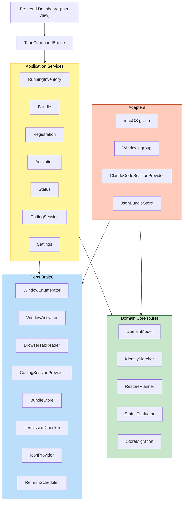

# 애플리케이션 설계 (통합본)

단계: INCEPTION — Application Design
본 문서는 `components.md` · `component-methods.md` · `services.md` · `component-dependency.md`의 통합 요약입니다. 상세는 각 문서를 참조하세요.

## 설계 결정 (확정)
| 항목 | 결정 |
|---|---|
| 아키텍처 스타일 | 헥사고날(포트&어댑터) |
| 상태 단일 소스 | 러스트 코어(프론트는 얇은 뷰) |
| OS 기능 추상화 | 기능별 분리 트레이트 |
| 코딩 세션 확장 | 도구별 어댑터 + 레지스트리(Claude Code 우선) |

## 계층
- **Domain Core (C1-C5)**: 순수 모델·식별(C2)·복원 계획(C3)·상태 판정(C4)·마이그레이션(C5). I/O 없음 → 단위/PBT 대상.
- **Ports (P1-P8)**: WindowEnumerator, WindowActivator, BrowserTabReader, CodingSessionProvider(+Registry), BundleStore, PermissionChecker, IconProvider, RefreshScheduler.
- **Adapters (A1-A4)**: macOS 어댑터군, Windows 어댑터군, ClaudeCodeSessionProvider, JsonBundleStore.
- **Services (S1-S7)**: RunningInventory, Bundle, Registration, Activation, Status, CodingSession, Settings.
- **Bridge/Frontend (B1/F1)**: Tauri 커맨드·이벤트 브리지 + 다크 대시보드 뷰.

## 아키텍처 다이어그램



### 텍스트 대안
```
Frontend -> Bridge -> Services -> {Ports, DomainCore}
Adapters -> implement Ports, reference DomainCore
DomainCore depends on nothing (pure)
```

## 핵심 유스케이스 매핑
- **등록(FR-3)**: RegistrationService + IdentityMatcher(중복/유사) + BundleStore.
- **개별/전체 활성화(FR-4/5)**: ActivationService + RestorePlanner + WindowActivator/BrowserTabReader, 부분 실패 지속·결과 요약.
- **상태 갱신(FR-7)**: StatusService + RefreshScheduler(절약·중복 방지) + StatusEvaluator.
- **브라우저(FR-9)**: BrowserTabReader + IdentityMatcher(탭 개별 추적).
- **OS별(FR-10)**: macOS/Windows 어댑터군 + PermissionChecker.
- **데이터(FR-11)**: JsonBundleStore + StoreMigration(원자적·마이그레이션·라운드트립).
- **코딩 세션(FR-12)**: CodingSessionService + Registry + ClaudeCodeSessionProvider(읽기 전용·견고 파싱).

## 확장(Extension) 반영
- **Security(Full)**: 입력 검증 경계=Bridge(SECURITY-05), 안전 역직렬화=Store/Migration·SessionProvider(SECURITY-13), 페일세이프=모든 `Result` + 원자적 저장·부분 실패 지속(SECURITY-15).
- **PBT(Partial)**: 라운드트립=StoreMigration(PBT-02), 파서 견고성=CodingSessionProvider(PBT-03). 순수 도메인 경계로 분리되어 property 테스트 용이.

## FR/AC 커버리지
- FR-1..FR-12 전부 컴포넌트/서비스에 매핑(`components.md` 커버리지 표).
- AC-1..AC-19 전부 관련 서비스/포트 책임으로 추적(`services.md`, `component-methods.md` 주석).

## 검증 결과
- 설계 완전성: 모든 FR 그룹이 ≥1 컴포넌트+서비스로 커버 — 확인.
- 일관성: 포트/어댑터/서비스 명칭이 4개 문서 간 일치 — 확인.
- 확장 제약: Security(Full)/PBT(Partial) 지점이 컴포넌트 책임에 명시 — 확인.
- 다음 단계(Functional Design)로 이월: 각 종류별 `ResourceIdentity` 상세 필드, 세션 파일 포맷/완료여부 판정 규칙, 에러 분류·재시도 정책.
