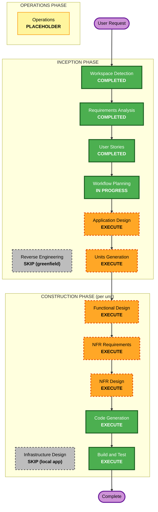

# Execution Plan

단계: INCEPTION — Workflow Planning
참조: `requirements.md`(FR-1..FR-12, NFR, AC-1..AC-19), `stories.md`(EPIC-1..EPIC-12, JS-1..JS-3), `personas.md`, `aidlc-state.md`(Extension: Security=Full, Resiliency=Off, PBT=Partial)

## Detailed Analysis Summary

### Transformation Scope
- **Project Type**: Greenfield (신규) — 역공학/모듈 조정 분석 N/A
- **Primary Changes**: Tauri(러스트 코어 + 웹 프론트엔드) 기반 크로스플랫폼 데스크톱 앱 신규 구축

### Change Impact Assessment
- **User-facing changes**: Yes — 앱 전체가 사용자 대면(대시보드, 등록/활성화/편집/전체 실행/세션 열람)
- **Structural changes**: Yes — 신규 아키텍처(도메인 코어 + OS 어댑터 + 저장소 + 세션 파서 + UI)
- **Data model changes**: Yes — 작업 묶음/리소스(창·탭·폴더·앱·URL·코딩 세션) 스키마, 버전 마이그레이션
- **API changes**: Yes(내부) — 프론트엔드↔러스트 커맨드 경계, OS 어댑터 트레이트 계약
- **NFR impact**: Yes — 성능(폴링 상한·자원 절약), 보안(Security Full 강제), 신뢰성(부분 실패·원자적 저장)

### Component Relationships
- N/A (Greenfield — 기존 컴포넌트 없음). 신규 컴포넌트 구조는 Application Design 단계에서 정의.

### Risk Assessment
- **Risk Level**: **High** — OS별 네이티브 자동화(macOS 접근성 / Windows UI Automation), 브라우저 탭·코딩 세션 파싱 등 외부 환경 의존이 크고 불확실성이 높음
- **Rollback Complexity**: Easy — 로컬 단일 앱, 서버/데이터 마이그레이션 없음
- **Testing Complexity**: Complex — 도메인 단위 + 모의 어댑터 통합 + 실제 OS E2E, PBT(라운드트립·파서 견고성)

## Workflow Visualization

### Mermaid Diagram



### Text Alternative (always include)

```
INCEPTION PHASE
- Workspace Detection ......... COMPLETED
- Reverse Engineering ......... SKIP (greenfield)
- Requirements Analysis ....... COMPLETED
- User Stories ................ COMPLETED
- Workflow Planning ........... IN PROGRESS
- Application Design .......... EXECUTE
- Units Generation ............ EXECUTE

CONSTRUCTION PHASE (repeats per unit)
- Functional Design ........... EXECUTE
- NFR Requirements ............ EXECUTE
- NFR Design .................. EXECUTE
- Infrastructure Design ....... SKIP (local desktop app, no cloud infra)
- Code Generation ............. EXECUTE (always)
- Build and Test .............. EXECUTE (always, after all units)

OPERATIONS PHASE
- Operations .................. PLACEHOLDER
```

## Phases to Execute

### 🔵 INCEPTION PHASE
- [x] Workspace Detection (COMPLETED)
- [x] Reverse Engineering (SKIPPED — greenfield, 기존 코드 없음)
- [x] Requirements Analysis (COMPLETED)
- [x] User Stories (COMPLETED)
- [x] Workflow Planning (IN PROGRESS)
- [ ] Application Design — **EXECUTE**
  - **Rationale**: 신규 시스템으로 컴포넌트/서비스 경계가 정의되어야 함 — 도메인 코어(작업 묶음/리소스 모델·식별·복원 규칙), OS 어댑터 트레이트(macOS/Windows), 저장소, 브라우저·코딩 세션 파서, 프론트엔드↔코어 커맨드 경계.
- [ ] Units Generation — **EXECUTE**
  - **Rationale**: 러스트 코어 + 다중 OS 어댑터 + 브라우저/세션 파서 + UI 등 복합 시스템을 구조적으로 분해해야 병렬·순차 구현이 명확해짐.

### 🟢 CONSTRUCTION PHASE (per-unit loop)
- [ ] Functional Design — **EXECUTE**
  - **Rationale**: 신규 데이터 모델(묶음/리소스 스키마, 버전 마이그레이션)과 복잡한 비즈니스 로직(창/탭/세션 식별·복원, 부분 실패, 상태 판정)의 상세 설계 필요.
- [ ] NFR Requirements — **EXECUTE**
  - **Rationale**: 성능(폴링 상한·백그라운드 절약·중복 방지), 보안(Security Baseline **Full** 강제), 신뢰성(원자적 저장·부분 실패) 요구가 존재. 기술 스택(Tauri)은 확정.
- [ ] NFR Design — **EXECUTE**
  - **Rationale**: NFR Requirements가 실행되므로 해당 패턴(입력 검증/안전 역직렬화/페일세이프/폴링 스케줄러)을 설계에 반영.
- [ ] Infrastructure Design — **SKIP**
  - **Rationale**: 로컬 데스크톱 앱으로 클라우드/서버 리소스 매핑·배포 아키텍처가 없음. 패키징/서명은 Build and Test에서 다룸.
- [ ] Code Generation — **EXECUTE (ALWAYS)**
  - **Rationale**: 구현 계획 및 코드 생성 필요.
- [ ] Build and Test — **EXECUTE (ALWAYS)**
  - **Rationale**: 빌드·단위/통합/E2E 테스트·PBT(라운드트립·파서 견고성) 검증 필요.

### 🟡 OPERATIONS PHASE
- [ ] Operations — PLACEHOLDER
  - **Rationale**: 향후 배포/모니터링 워크플로우 확장 자리.

## Package Change Sequence
- N/A (Greenfield). 구체적 단위 분해와 순서는 Units Generation에서 확정.

## Estimated Timeline
- **Total Stages to Execute**: INCEPTION 2개(Application Design, Units Generation) + CONSTRUCTION per-unit(Functional Design, NFR Requirements, NFR Design, Code Generation) + Build and Test
- **Estimated Duration**: 단위 수에 따라 가변 — 정확한 추정은 Units Generation 이후 산정.

## Success Criteria
- **Primary Goal**: 작업 묶음을 저장/복원하고, 창·탭·폴더·앱·URL·코딩 세션을 정확히 식별·활성화하는 크로스플랫폼(macOS+Windows) 데스크톱 앱 구현.
- **Key Deliverables**: 도메인 코어, macOS/Windows OS 어댑터, 브라우저 탭 수집, 코딩 세션(읽기 전용) 표시, 단일 JSON 저장소(원자적·마이그레이션), 다크 대시보드 UI.
- **Quality Gates**:
  - 인수 조건 AC-1..AC-19 충족
  - Security Baseline(Full) 적용 규칙 준수(입력 검증·안전 역직렬화·페일세이프)
  - PBT(Partial) 대상 통과: PBT-02(라운드트립), PBT-03(파서 견고성), PBT-07/08/09
  - 도메인 단위 + 모의 어댑터 통합 + 실제 OS E2E 통과
