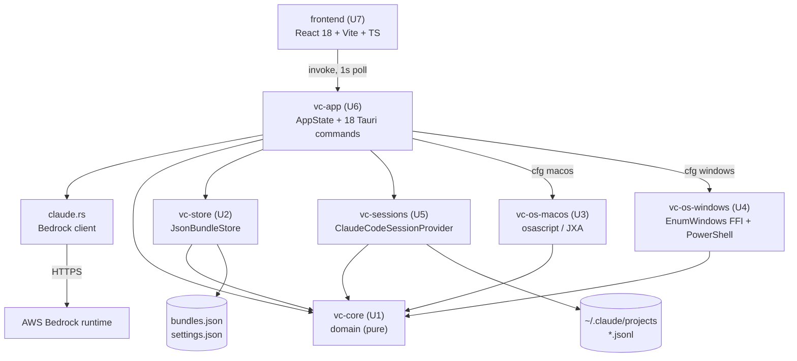
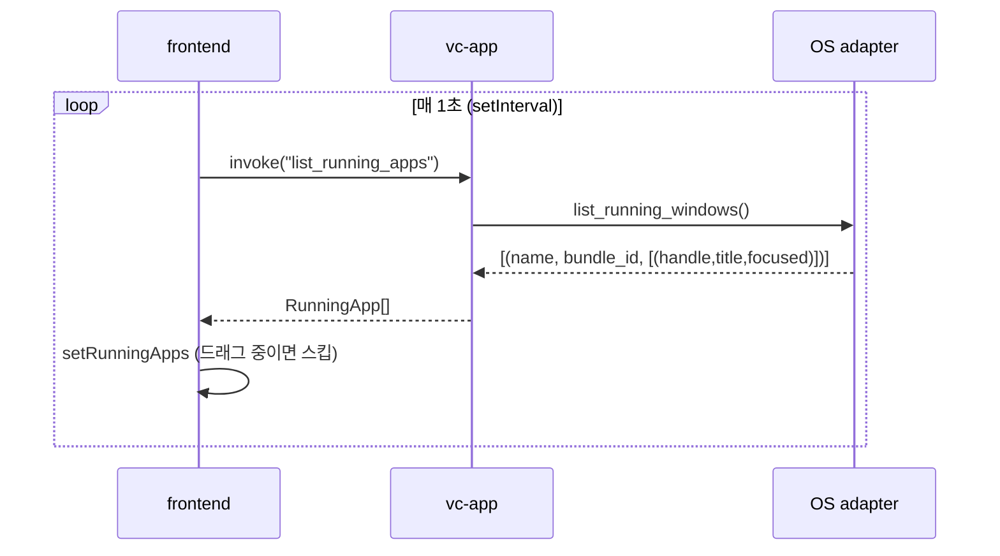
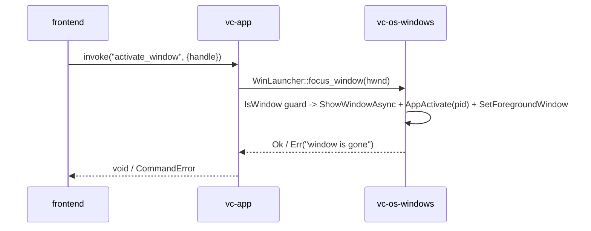
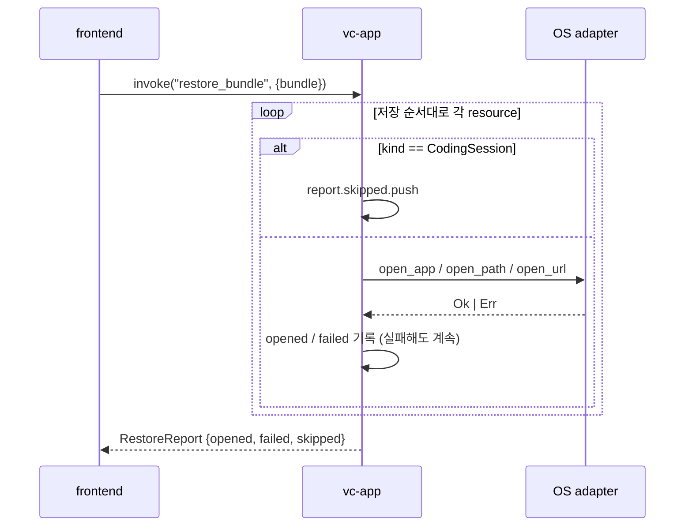

# System Architecture

단계: INCEPTION — Reverse Engineering (재실행 2026-09-08) · 커밋 `d1e0f2f`

## System Overview

vibe-control는 **단일 Tauri v2 데스크톱 앱**이다. Rust Cargo 워크스페이스 6개 크레이트 + React/Vite/TypeScript 프론트엔드 1개로 구성되며, 서버·클라우드 인프라가 없다(예외: 앱 내 Claude 콘솔이 AWS Bedrock 런타임을 HTTPS로 호출). 상태의 단일 소스는 `vc-app`의 `AppState`이며, 프론트엔드는 Tauri `invoke` 커맨드로만 통신한다(이벤트 emit/listen 없음 — **1초 폴링**).

## Architecture Diagram

**텍스트 대안**: frontend → vc-app(커맨드) → {vc-core, vc-store, vc-sessions, cfg로 선택된 OS 어댑터}. 모든 하위 크레이트는 vc-core에만 의존한다(순환 없음). vc-store는 로컬 JSON 파일에, vc-sessions는 Claude Code jsonl 파일에 접근한다. claude.rs만 외부 네트워크(Bedrock)를 호출한다.

## Component Descriptions

### vc-core
- **Purpose**: 순수 도메인 로직(I/O 없음)
- **Responsibilities**: models(`WorkBundle`/`Resource`/`ResourceIdentity`/`AppSettings`), matching(`match_signature`/`distinct_key`/`window::matches`), restore(`plan_reopen`/`plan_bundle_activation`), evaluate(`evaluate_status`/`is_noise`/`evaluate`), normalize(url/path/app_id), migrate(`load_and_migrate`/`serialize`), error(`CoreError`)
- **Dependencies**: 없음 (serde, serde_json, uuid, thiserror, sha2)
- **Type**: Model / Domain Library
- **관측 사항**: 트레이트 정의 0개. `matching`/`restore`/`evaluate`는 vc-app에서 **미사용**.

### vc-store
- **Purpose**: 영속성
- **Responsibilities**: `BundleStore` 트레이트, `JsonBundleStore`(load/save/load_settings/save_settings)
- **Dependencies**: vc-core, serde_json, dirs
- **Type**: Application (infrastructure adapter)

### vc-os-macos
- **Purpose**: macOS OS 어댑터 (`#[cfg(target_os="macos")]`)
- **Responsibilities**: `MacWindowEnumerator`(list_running / list_running_apps / list_running_windows), `MacBrowserTabReader`(Safari/Chrome), `MacLauncher`(open_app/focus_window/open_path/open_url/run_in_terminal/activate_terminal), `MacIconReader`
- **Dependencies**: vc-core (+ 외부 프로세스 `osascript`)
- **Type**: Application (OS adapter)

### vc-os-windows
- **Purpose**: Windows OS 어댑터 (`#[cfg(target_os="windows")]`)
- **Responsibilities**: `WinWindowEnumerator`(Win32 `EnumWindows` 네이티브 FFI 기반 창 열거 → 앱별 그룹핑), `WinIconReader`(PowerShell+C# shell32), `WinBrowserTabReader`(**스텁**), `WinLauncher`(open_app / focus_existing_window / focus_window(HWND) / open_path / open_url / run_in_terminal / activate_terminal)
- **Dependencies**: vc-core (+ user32/dwmapi/kernel32 링크, PowerShell)
- **Type**: Application (OS adapter)

### vc-sessions
- **Purpose**: 코딩 에이전트 세션 어댑터
- **Responsibilities**: `CodingSessionProvider` 트레이트, `SessionProviderRegistry`, `ClaudeCodeSessionProvider`(discover/read_snapshot/resume_info), `parse_session_bytes`(손상 허용)
- **Dependencies**: vc-core, serde, serde_json, dirs
- **Type**: Application (adapter)

### vc-app
- **Purpose**: 오케스트레이션 + Tauri 브리지 + 바이너리
- **Responsibilities**: `AppState`, 18개 커맨드, cfg 어댑터 디스패치, Bedrock 클라이언트
- **Dependencies**: tauri 2.0, reqwest 0.13, serde, serde_json, vc-core, vc-store, vc-sessions, vc-os-macos, vc-os-windows
- **Type**: Application (binary)

### frontend
- **Purpose**: 웹뷰 UI
- **Responsibilities**: 실행 앱 패널(그룹+창 펼침), 검색, DnD 등록, 묶음 카드/복원 리포트, 세션 상태, Claude 콘솔, 부팅 스플래시
- **Dependencies**: @tauri-apps/api 2.x, react 18.3, vite 6
- **Type**: Application (UI)

## Data Flow

### 상태 갱신 루프 (실측 동작)

### 창 활성화 (BT-2)

### 묶음 전체 복원 (BT-6)

## Integration Points

- **External APIs**: AWS Bedrock Runtime `POST https://bedrock-runtime.{region}.amazonaws.com/model/{model}/invoke` — 앱 내 Claude 프롬프트 콘솔 전용. `Authorization: Bearer <Bedrock API key>`.
- **Databases**: 없음. 로컬 파일 2개 — `<OS config>/vibe-control/bundles.json`(원자 교체), `<OS config>/vibe-control/settings.json`(비원자적 쓰기).
- **Third-party Services**: 없음(위 Bedrock 제외).
- **OS 통합**: macOS `osascript`(AppleScript/JXA), `NSWorkspace`, System Events / Windows Win32 `EnumWindows`·`SetForegroundWindow` 등 FFI + PowerShell(`Start-Process`, shell32 아이콘, `wt`/`powershell` 터미널).
- **읽기 전용 파일 통합**: Claude Code 세션 로그 `~/.claude/projects/**/*.jsonl`.

## Infrastructure Components

- **CDK Stacks**: 없음.
- **Deployment Model**: Tauri 번들(`bundle.active=true`, `targets="all"`) — macOS·Windows 각 OS에서 별도 빌드하는 로컬 설치형 데스크톱 앱. CI/CD 파이프라인 없음(`.github/` 부재).
- **Networking**: 앱 자체는 서버를 열지 않음. 아웃바운드 HTTPS 1개(Bedrock). 개발 시 Vite dev 서버 `localhost:1420`.
