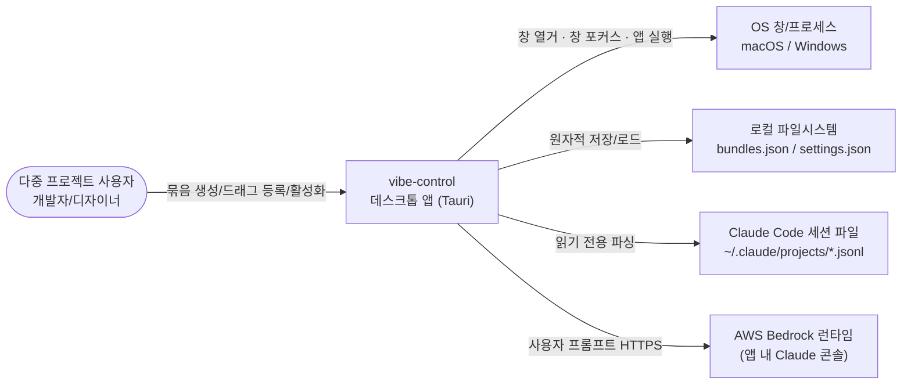

# Business Overview

단계: INCEPTION — Reverse Engineering (재실행 2026-09-08)
분석 대상: 커밋 `d1e0f2f` (main) 시점의 워크스페이스

## Business Context Diagram

**텍스트 대안**: 사용자가 vibe-control 앱을 조작한다. 앱은 (1) OS의 창/프로세스를 열거·포커스·실행하고, (2) 로컬 JSON 파일에 작업 묶음과 설정을 저장하며, (3) Claude Code 세션 파일을 읽기 전용으로 파싱하고, (4) 사용자가 명시적으로 입력한 프롬프트만 AWS Bedrock으로 HTTPS 전송한다.

## Business Description

- **Business Description**: 여러 프로젝트를 오가는 사용자가 프로젝트별로 필요한 앱·창·폴더·URL·코딩 에이전트 세션을 하나의 "작업 묶음(Work Bundle)"으로 저장하고, 한 번의 조작으로 그 작업 환경을 복원·전환하게 하는 로컬 전용 데스크톱 앱.

- **Business Transactions** (현행 코드가 실제로 구현한 것):

| # | 트랜잭션 | 진입점 | 구현 경로 |
|---|---|---|---|
| BT-1 | 실행 중인 앱·창 목록 조회 | 좌측 패널 1초 폴링 | `list_running_apps` → `enumerate_running_windows` → OS 어댑터 `list_running_windows` |
| BT-2 | 특정 창 최전면 활성화 | 창 하위행 클릭 | `activate_window(handle)` → `focus_window` → `WinLauncher::focus_window` / `MacLauncher::focus_window` |
| BT-3 | 앱 활성화(폴백·재실행) | 앱 행 클릭(창 정보 없음) | `activate_app(target)` → `open_app` |
| BT-4 | 작업 묶음 생성/삭제 | Add Group / 삭제 버튼 | `create_bundle` / `delete_bundle` → `JsonBundleStore::save` |
| BT-5 | 실행 앱을 묶음에 드래그 등록 | HTML5 DnD | `add_app_resource` (인라인 중복 방지) |
| BT-6 | 묶음 전체 복원 | 카드의 복원 버튼 | `restore_bundle` → `reopen_resource` 반복(부분 실패 지속) → `RestoreReport` |
| BT-7 | 코딩 세션 상태 조회 | 카드 내 인라인 표시 | `get_session_snapshot` → `ClaudeCodeSessionProvider::read_snapshot` |
| BT-8 | 코딩 세션 재개 / 터미널 포커스 | Resume / View 버튼 | `resume_coding_session` / `activate_coding_session` |
| BT-9 | 앱 아이콘 조회 | 아이콘 지연 로드 | `get_app_icon` → `WinIconReader` / `MacIconReader` (프로세스 수명 캐시) |
| BT-10 | 앱 내 Claude 프롬프트 대화 | 하단 콘솔 | `send_claude_message` → Bedrock `InvokeModel` |
| BT-11 | Claude 연결 설정 | 콘솔 모달 | `claude_status` / `set_claude_api_key` / `set_claude_model` |
| BT-12 | 현재 상태 캡처 | **(UI 미배선)** | `capture_current` / `save_bundles` — 백엔드에만 존재 |

- **Business Dictionary**:

| 용어 | 의미 |
|---|---|
| Work Bundle (작업 묶음 / Group) | 한 프로젝트의 리소스 모음. `{id, name, resources[]}` |
| Resource | 묶음 안의 한 항목. 종류: WindowRef / BrowserTab / Folder / AppLaunch / Url / CodingSession |
| ResourceIdentity | 리소스의 복합 식별 정보 — 안정 서술자(descriptor) + 비영속 힌트(hint) + 재실행 정보(reopen_info) |
| Running App | 현재 실행 중인 앱 그룹(아이콘 1회) |
| Running Window (창/탭) | 앱 그룹 안의 개별 최상위 창. 활성화 토큰 = Windows HWND / macOS `name\u{1f}title` |
| Coding Session | Claude Code 등 코딩 에이전트의 로컬 세션. **Running Window와 구분되는 별개 개념** |
| Restore / Activation | 저장된 리소스를 다시 열거나 최전면으로 가져오는 동작 |
| Claude Console | 앱 하단의 Bedrock 경유 프롬프트 콘솔 (원 요구사항 밖의 신규 기능) |

## Component Level Business Descriptions

### vc-core (U1)
- **Purpose**: 순수 도메인 규칙 — 리소스 식별·매칭·복원 계획·상태 판정·정규화·버전 마이그레이션.
- **Responsibilities**: `WorkBundle`/`Resource` 모델, `match_signature`/`distinct_key`, `matching::window::matches`, `plan_reopen`/`plan_bundle_activation`, `evaluate_status`/`is_noise`, `normalize_url/path/app_id`, `load_and_migrate`/`serialize`.
- **비즈니스 관점 주의**: 매칭·복원계획·상태판정은 구현되어 있으나 **vc-app이 호출하지 않는다**(오케스트레이션 미배선).

### vc-store (U2)
- **Purpose**: 작업 묶음과 앱 설정의 로컬 영속화.
- **Responsibilities**: `BundleStore` 트레이트 + `JsonBundleStore`(OS config 디렉터리의 `bundles.json` temp→rename 원자 교체, `settings.json` 직접 쓰기).

### vc-os-macos (U3) / vc-os-windows (U4)
- **Purpose**: OS별 창 열거·창 포커스·앱/경로/URL 실행·아이콘 추출·터미널 제어.
- **Responsibilities(mac)**: `osascript`/JXA + `NSWorkspace` 셸아웃. **Responsibilities(win)**: Win32 `EnumWindows` 네이티브 FFI 열거 + PowerShell 기반 실행/아이콘.

### vc-sessions (U5)
- **Purpose**: 코딩 에이전트 세션의 읽기 전용 열람.
- **Responsibilities**: `CodingSessionProvider` 트레이트 + `SessionProviderRegistry` + `ClaudeCodeSessionProvider`(`~/.claude/projects/**/*.jsonl` 손상 허용 파싱, 마지막 질문·답변 완료여부 판정).

### vc-app (U6)
- **Purpose**: 유스케이스 오케스트레이션 + Tauri 커맨드 경계 + 어댑터 cfg 조립.
- **Responsibilities**: `AppState`(스토어·묶음·설정·아이콘 캐시) + **18개** `#[tauri::command]` 핸들러 + Bedrock 클라이언트(`claude.rs`).

### frontend (U7)
- **Purpose**: 다크 대시보드 UI(좌 실행 패널 / 우 묶음 카드 / 하단 Claude 콘솔 / 부팅 스플래시).
- **Responsibilities**: 1초 폴링 기반 상태 갱신, 앱 그룹 펼침/접기, HTML5 드래그 등록, 복원 리포트 표시, 콘솔 대화.
