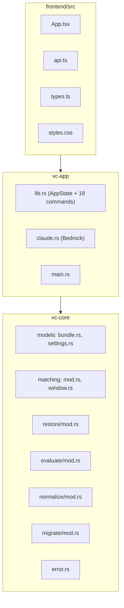

# Code Structure

단계: INCEPTION — Reverse Engineering (재실행 2026-09-08) · 커밋 `d1e0f2f`

## Build System

- **Type**: Cargo workspace (resolver 2, edition 2021) + npm/Vite (frontend) + Tauri v2 번들러
- **Configuration**:
  - `Cargo.toml` (루트) — members: `crates/{vc-core,vc-store,vc-os-macos,vc-os-windows,vc-sessions,vc-app}`
  - `crates/vc-app/tauri.conf.json` — productName `vibe-control`, identifier `com.vibecontrol.desktop`, `frontendDist: ../../frontend/dist`, `devUrl: localhost:1420`, `dragDropEnabled: false`(HTML5 DnD를 쓰기 위함), **`security.csp: null`**, `bundle.targets: "all"`
  - `crates/vc-app/capabilities/default.json` — permissions `["core:default"]`만
  - `frontend/package.json` — `build: tsc && vite build`
  - **부재**: `.github/` CI, 커버리지 도구 설정, `rustfmt.toml`/`clippy.toml`, `benches/`, `tests/` 통합 테스트 디렉터리

## Module Hierarchy

### Existing Files Inventory

| 파일 | LOC | 목적 |
|---|---:|---|
| `Cargo.toml` | 15 | 워크스페이스 정의 |
| `crates/vc-core/src/lib.rs` | 20 | 공개 API re-export |
| `crates/vc-core/src/models/bundle.rs` | 148 | `WorkBundle`/`Resource`/`ResourceIdentity`/`ResourceKind`/`ResourceStatus`/`SessionCompletion` |
| `crates/vc-core/src/models/settings.rs` | 42 | `AppSettings`(레이아웃 4필드 평탄화 + Claude 3필드) |
| `crates/vc-core/src/models/mod.rs` | 5 | 모델 re-export |
| `crates/vc-core/src/matching/mod.rs` | 127 | `MatchSignature`·`match_signature`·`distinct_key`(DefaultHasher 사용) |
| `crates/vc-core/src/matching/window.rs` | 104 | `RunningItem` + 계층 매칭 `matches` (**vc-app 미사용**) |
| `crates/vc-core/src/restore/mod.rs` | 121 | `ReopenAction`·`plan_reopen`·`plan_bundle_activation` (**vc-app 미사용**) |
| `crates/vc-core/src/evaluate/mod.rs` | 86 | `evaluate_status`·`is_noise`·`evaluate` (**vc-app 미사용**) |
| `crates/vc-core/src/normalize/mod.rs` | 115 | URL/경로/앱ID 정규화 + 주입 문자 거부 (**vc-app 미사용**) |
| `crates/vc-core/src/migrate/mod.rs` | 148 | 버전 태깅 직렬화 + `load_and_migrate` + PBT-02/PBT-03 proptest |
| `crates/vc-core/src/error.rs` | 49 | `CoreError`(thiserror) |
| `crates/vc-store/src/lib.rs` | 149 | `BundleStore` 트레이트 + `JsonBundleStore` |
| `crates/vc-os-macos/src/lib.rs` | 531 | macOS 어댑터 4종 |
| `crates/vc-os-windows/src/lib.rs` | 782 | Windows 어댑터 4종 + `winffi` FFI 모듈 |
| `crates/vc-sessions/src/lib.rs` | 475 | 세션 provider/registry/파서 + PBT |
| `crates/vc-app/src/lib.rs` | 795 | `AppState` + 18개 Tauri 커맨드 + cfg 디스패치 |
| `crates/vc-app/src/claude.rs` | 149 | Bedrock InvokeModel 클라이언트 |
| `crates/vc-app/src/main.rs` | 5 | 바이너리 엔트리 |
| `crates/vc-app/build.rs` | 3 | `tauri_build::build()` |
| `frontend/src/App.tsx` | 957 | 전체 UI(스플래시·패널·카드·콘솔) |
| `frontend/src/api.ts` | 123 | 18개 커맨드 중 17개 래퍼(`activate_window` 포함; `save_bundles`/`capture_current`는 고아) |
| `frontend/src/types.ts` | 87 | 백엔드 DTO 타입 미러 |
| `frontend/src/styles.css` | 1142 | EP-133 모티프 다크 대시보드 + 스플래시 |
| `frontend/index.html` | 27 | 프리마운트 배경색만 인라인 |

## Design Patterns

### Adapter (플랫폼 어댑터)
- **Location**: `vc-os-macos` / `vc-os-windows`, `vc-app`의 `#[cfg(target_os=…)]` 자유 함수(`open_app`, `focus_window`, `enumerate_running_windows` …)
- **Purpose**: OS 차이를 크레이트 경계로 격리
- **Implementation**: **트레이트 없는** 구체 struct + 컴파일 타임 cfg 디스패치 (DI 아님)

### Registry (플러그인)
- **Location**: `vc-sessions::SessionProviderRegistry`
- **Purpose**: 코딩 에이전트 도구별 provider 확장
- **Implementation**: `Box<dyn CodingSessionProvider>` 목록 + `tool_id` 조회 — 프로젝트에서 **유일하게 포트/DI 형태가 살아있는 지점**

### Repository
- **Location**: `vc-store::BundleStore` + `JsonBundleStore`
- **Purpose**: 영속 저장소 추상화
- **Implementation**: 트레이트 + JSON 파일 구현. `AppState`가 `Box<dyn BundleStore + Send>`로 보유

### Atomic write (temp→rename)
- **Location**: `vc-store::JsonBundleStore::save`
- **Purpose**: 저장 중 손상 방지(FR-11.6)
- **Implementation**: `bundles.json.tmp` 쓰기 → `fs::rename`. **`settings.json`은 이 패턴 미적용**

### Cache-aside
- **Location**: `AppState.icon_cache`(백엔드, `None`도 캐시) + `frontend/App.tsx`의 모듈 레벨 `iconCache`
- **Purpose**: 아이콘 반복 추출 비용 제거(NFR-Pf4)
- **Implementation**: 락 해제 후 추출 → 재획득 후 삽입(느린 호출을 락 밖에서 수행)

### Polling with in-flight guard
- **Location**: `frontend/App.tsx` 1초 `setInterval` + `draggedApp.current` 가드
- **Purpose**: 라이브 상태 유지 + 드래그 중 리렌더로 인한 DnD 취소 방지

### FFI facade
- **Location**: `vc-os-windows::winffi`
- **Purpose**: `windows`/`winapi` 크레이트 없이 최소 표면으로 Win32 직접 호출
- **Implementation**: `#[link(name="user32"/"dwmapi"/"kernel32")] extern "system"` 블록 + `EnumWindows` 콜백

## Critical Dependencies

| 의존성 | 버전 | 사용처 | 목적 |
|---|---|---|---|
| tauri | 2.0 | vc-app | 데스크톱 셸·커맨드 브리지·번들러 |
| reqwest | 0.13 (`json`, `default-tls`, no default) | vc-app/claude.rs | Bedrock HTTPS 호출 (플랫폼 TLS 사용 → OpenSSL 불필요) |
| serde / serde_json | 1.0 | 전 크레이트 | 직렬화·JSON |
| uuid | 1.0 (v4, serde) | vc-core | `BundleId`/`ResourceId` |
| thiserror | 1.0 | vc-core | 에러 타입 |
| dirs | 5.0 | vc-store, vc-sessions | OS config/home 디렉터리 확인 |
| sha2 | 0.10 | vc-core | **미사용**(매칭은 `std::DefaultHasher`) |
| proptest | 1.0 (dev) | vc-core, vc-store, vc-sessions | PBT-02/03 |
| react / react-dom | 18.3 | frontend | UI |
| vite | 6.0 | frontend | 번들러 |
| typescript | 5.6 | frontend | 타입 검사(`tsc` in build) |
