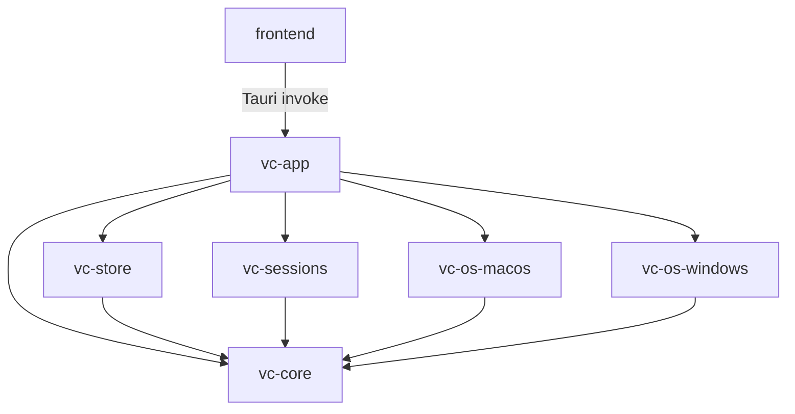

# Dependencies

단계: INCEPTION — Reverse Engineering (재실행 2026-09-08) · 커밋 `d1e0f2f`

## Internal Dependencies

**텍스트 대안**: frontend는 vc-app에만(런타임 커맨드 계약) 의존한다. vc-app은 나머지 5개 크레이트 전부에 의존한다. vc-store / vc-sessions / vc-os-macos / vc-os-windows는 각각 vc-core에만 의존한다. vc-core는 의존이 없다. **순환 없음** — 의존 방향은 항상 vc-core를 향한다(설계와 일치).

### vc-app depends on vc-core / vc-store / vc-sessions / vc-os-macos / vc-os-windows
- **Type**: Compile + Runtime
- **Reason**: 모델·영속·세션·OS 어댑터를 직접 조립. OS 어댑터는 `Cargo.toml`에 **무조건 선언**되어 있고 코드에서 `#[cfg(target_os=…)]`로 선택 사용된다(대상 OS가 아닌 어댑터는 컴파일되지만 호출되지 않음).

### vc-store / vc-sessions / vc-os-* depends on vc-core
- **Type**: Compile
- **Reason**: `WorkBundle`/`AppSettings`/`Result`/`CoreError` 등 공유 모델·에러 타입. **포트 트레이트는 vc-core에 없으므로 어댑터가 core의 트레이트를 구현하지는 않는다.**

### frontend depends on vc-app
- **Type**: Runtime (Tauri IPC)
- **Reason**: 18개 커맨드 계약. 타입은 `frontend/src/types.ts`에 수동 미러링(자동 생성 아님 → 계약 드리프트 위험).

## External Dependencies

| 이름 | 버전 | 사용처 | 목적 | 라이선스 |
|---|---|---|---|---|
| tauri | 2.0 | vc-app | 데스크톱 런타임/IPC/번들 | Apache-2.0 OR MIT |
| reqwest | 0.13 (no-default, `json`+`default-tls`) | vc-app | Bedrock HTTPS 호출 | Apache-2.0 OR MIT |
| serde | 1.0 (derive) | 전 크레이트 | 직렬화 | Apache-2.0 OR MIT |
| serde_json | 1.0 | core/store/sessions/app | JSON | Apache-2.0 OR MIT |
| uuid | 1.0 (v4, serde) | vc-core | 식별자 | Apache-2.0 OR MIT |
| thiserror | 1.0 | vc-core | 에러 파생 | Apache-2.0 OR MIT |
| dirs | 5.0 | vc-store, vc-sessions | OS 표준 디렉터리 | Apache-2.0 OR MIT |
| sha2 | 0.10 | vc-core | **미사용**(제거 후보) | Apache-2.0 OR MIT |
| proptest | 1.0 (dev) | core/store/sessions | 속성 기반 테스트 | Apache-2.0 OR MIT |
| react, react-dom | 18.3 | frontend | UI | MIT |
| @tauri-apps/api | 2.x | frontend | invoke 바인딩 | Apache-2.0 OR MIT |
| vite, @vitejs/plugin-react | 6.0 / 4.3 | frontend(dev) | 번들러 | MIT |
| typescript | 5.6 | frontend(dev) | 타입 검사 | Apache-2.0 |

## 공급망 (SECURITY-10) 관측
- `Cargo.lock` ✅ 커밋됨 / `frontend/package-lock.json` ✅ 커밋됨
- 버전 핀: Cargo는 캐럿(`"2.0"`, `"1.0"`) 범위 — 정확한 핀은 lock 파일에 의존. npm은 `^` 범위.
- 취약점 스캔(`cargo audit` / `npm audit`) 실행 흔적·설정 **없음**, CI **없음**.
